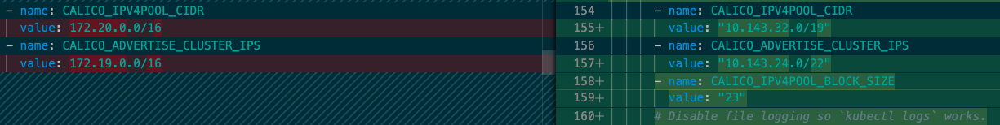
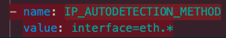
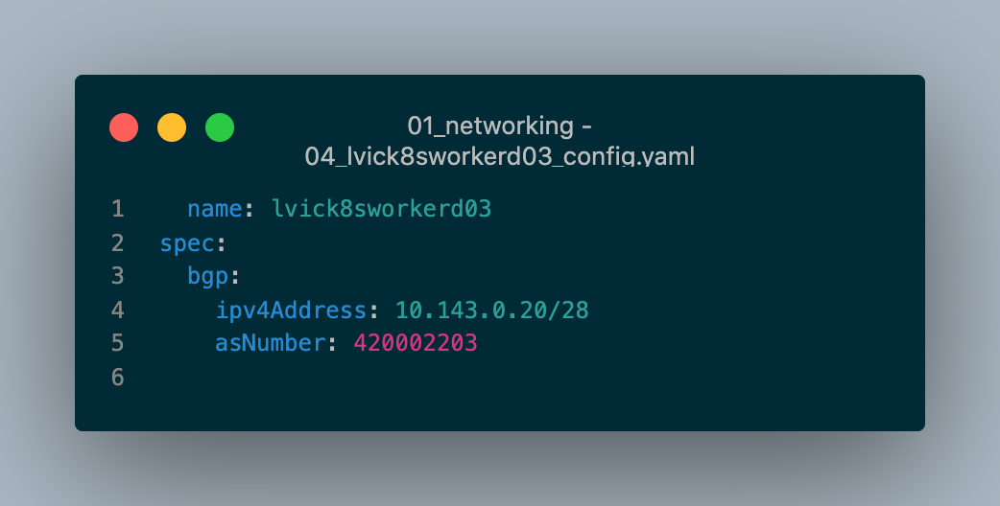
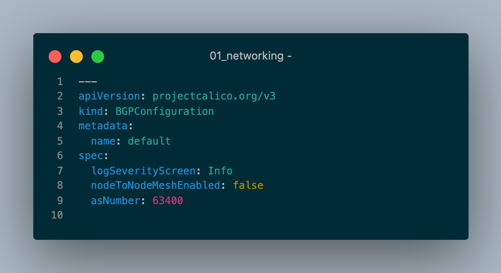

## Ingram Content Calico Instructions Walkthrough

Below is a step by step breakdown review of the Calico Configs provided by Ingram Content

### Applying 01_calico.yaml

In comparing 01_calico.yaml - this setting was configured on Karbon, but set to `none` in Ingram Content version:

  `typha_service_name: calico-typha`

Looks like we enable for scaling / performance reasons: https://docs.projectcalico.org/reference/typha/overview

Listing of calico crds found within Karbon Cluster. An `x` was placed next to each one found in corresponding `01_calico.yaml`  Looks like we're running later version of calico (3.10.0 vs. 3.14.0)

```bash
$ kubectl get crds | grep calico
bgpconfigurations.crd.projectcalico.org               2021-04-21T16:02:26Z x
bgppeers.crd.projectcalico.org                        2021-04-21T16:02:26Z x
blockaffinities.crd.projectcalico.org                 2021-04-21T16:02:26Z x
clusterinformations.crd.projectcalico.org             2021-04-21T16:02:26Z x
felixconfigurations.crd.projectcalico.org             2021-04-21T16:02:26Z x
globalnetworkpolicies.crd.projectcalico.org           2021-04-21T16:02:26Z x
globalnetworksets.crd.projectcalico.org               2021-04-21T16:02:26Z x
hostendpoints.crd.projectcalico.org                   2021-04-21T16:02:26Z x
ipamblocks.crd.projectcalico.org                      2021-04-21T16:02:26Z x
ipamconfigs.crd.projectcalico.org                     2021-04-21T16:02:26Z x
ipamhandles.crd.projectcalico.org                     2021-04-21T16:02:26Z x
ippools.crd.projectcalico.org                         2021-04-21T16:02:26Z x
kubecontrollersconfigurations.crd.projectcalico.org   2021-04-21T16:02:26Z
networkpolicies.crd.projectcalico.org                 2021-04-21T16:02:26Z x
networksets.crd.projectcalico.org                     2021-04-21T16:02:26Z x
```

RBAC Access Matrix

```bash
$ kubectl-access_matrix --sa kube-system:calico-node
NAME                                                          LIST  CREATE  UPDATE  DELETE
alertmanagers.monitoring.coreos.com                           ✖     ✖       ✖       ✖
apiservices.apiregistration.k8s.io                            ✖     ✖       ✖       ✖
bgpconfigurations.crd.projectcalico.org                       ✔     ✔       ✔       ✖
bgppeers.crd.projectcalico.org                                ✔     ✔       ✔       ✖
bindings                                                            ✖
blockaffinities.crd.projectcalico.org                         ✔     ✔       ✔       ✔
certificaterequests.cert-manager.io                           ✖     ✖       ✖       ✖
certificates.cert-manager.io                                  ✖     ✖       ✖       ✖
certificatesigningrequests.certificates.k8s.io                ✖     ✖       ✖       ✖
challenges.acme.cert-manager.io                               ✖     ✖       ✖       ✖
clusterinformations.crd.projectcalico.org                     ✔     ✔       ✔       ✖
clusterissuers.cert-manager.io                                ✖     ✖       ✖       ✖
clusterrolebindings.rbac.authorization.k8s.io                 ✖     ✖       ✖       ✖
clusterroles.rbac.authorization.k8s.io                        ✖     ✖       ✖       ✖
componentstatuses                                             ✖
configmaps                                                    ✖     ✖       ✖       ✖
controllerrevisions.apps                                      ✖     ✖       ✖       ✖
cronjobs.batch                                                ✖     ✖       ✖       ✖
csidrivers.storage.k8s.io                                     ✖     ✖       ✖       ✖
csinodes.storage.k8s.io                                       ✖     ✖       ✖       ✖
customresourcedefinitions.apiextensions.k8s.io                ✖     ✖       ✖       ✖
daemonsets.apps                                               ✖     ✖       ✖       ✖
deployments.apps                                              ✖     ✖       ✖       ✖
endpoints                                                     ✔     ✖       ✖       ✖
endpointslices.discovery.k8s.io                               ✖     ✖       ✖       ✖
events                                                        ✖     ✖       ✖       ✖
events.events.k8s.io                                          ✖     ✖       ✖       ✖
felixconfigurations.crd.projectcalico.org                     ✔     ✔       ✔       ✖
globalnetworkpolicies.crd.projectcalico.org                   ✔     ✖       ✖       ✖
globalnetworksets.crd.projectcalico.org                       ✔     ✖       ✖       ✖
horizontalpodautoscalers.autoscaling                          ✖     ✖       ✖       ✖
hostendpoints.crd.projectcalico.org                           ✔     ✖       ✖       ✖
ingressclasses.networking.k8s.io                              ✖     ✖       ✖       ✖
ingresses.extensions                                          ✖     ✖       ✖       ✖
ingresses.networking.k8s.io                                   ✖     ✖       ✖       ✖
ipamblocks.crd.projectcalico.org                              ✔     ✔       ✔       ✔
ipamconfigs.crd.projectcalico.org                             ✖     ✖       ✖       ✖
ipamhandles.crd.projectcalico.org                             ✔     ✔       ✔       ✔
ippools.crd.projectcalico.org                                 ✔     ✔       ✔       ✖
issuers.cert-manager.io                                       ✖     ✖       ✖       ✖
jobs.batch                                                    ✖     ✖       ✖       ✖
kubecontrollersconfigurations.crd.projectcalico.org           ✖     ✖       ✖       ✖
leases.coordination.k8s.io                                    ✖     ✖       ✖       ✖
limitranges                                                   ✖     ✖       ✖       ✖
localsubjectaccessreviews.authorization.k8s.io                      ✖
mutatingwebhookconfigurations.admissionregistration.k8s.io    ✖     ✖       ✖       ✖
namespaces                                                    ✔     ✖       ✖       ✖
networkpolicies.crd.projectcalico.org                         ✔     ✖       ✖       ✖
networkpolicies.networking.k8s.io                             ✔     ✖       ✖       ✖
networksets.crd.projectcalico.org                             ✔     ✖       ✖       ✖
nodes                                                         ✔     ✖       ✖       ✖
nodes.metrics.k8s.io                                          ✖
orders.acme.cert-manager.io                                   ✖     ✖       ✖       ✖
persistentvolumeclaims                                        ✖     ✖       ✖       ✖
persistentvolumes                                             ✖     ✖       ✖       ✖
poddisruptionbudgets.policy                                   ✖     ✖       ✖       ✖
podmonitors.monitoring.coreos.com                             ✖     ✖       ✖       ✖
pods                                                          ✔     ✖       ✖       ✖
pods.metrics.k8s.io                                           ✖
podsecuritypolicies.policy                                    ✖     ✖       ✖       ✖
podtemplates                                                  ✖     ✖       ✖       ✖
priorityclasses.scheduling.k8s.io                             ✖     ✖       ✖       ✖
prometheuses.monitoring.coreos.com                            ✖     ✖       ✖       ✖
prometheusrules.monitoring.coreos.com                         ✖     ✖       ✖       ✖
replicasets.apps                                              ✖     ✖       ✖       ✖
replicationcontrollers                                        ✖     ✖       ✖       ✖
resourcequotas                                                ✖     ✖       ✖       ✖
rolebindings.rbac.authorization.k8s.io                        ✖     ✖       ✖       ✖
roles.rbac.authorization.k8s.io                               ✖     ✖       ✖       ✖
runtimeclasses.node.k8s.io                                    ✖     ✖       ✖       ✖
secrets                                                       ✖     ✖       ✖       ✖
selfsubjectaccessreviews.authorization.k8s.io                       ✔
selfsubjectrulesreviews.authorization.k8s.io                        ✔
serviceaccounts                                               ✔     ✖       ✖       ✖
servicemonitors.monitoring.coreos.com                         ✖     ✖       ✖       ✖
services                                                      ✔     ✖       ✖       ✖
statefulsets.apps                                             ✖     ✖       ✖       ✖
storageclasses.storage.k8s.io                                 ✖     ✖       ✖       ✖
subjectaccessreviews.authorization.k8s.io                           ✖
tokenreviews.authentication.k8s.io                                  ✖
validatingwebhookconfigurations.admissionregistration.k8s.io  ✖     ✖       ✖       ✖
volumeattachments.storage.k8s.io                              ✖     ✖       ✖       ✖
```

> calico daemonset/deployment comparison between karbon and Ingram Content provided

Screenshots of parameters below - nothing critical that stands out, imho






### Label Nodes

> Node labels will be fine, just need to be cognizant of new worker nodes that will not have by default...Could include in Calm Workflow when adding nodes

```
$ kubectl get nodes -o name | cut -d/ -f2 | xargs -I {} kubectl exec -i -n kube-system calicoctl -- /calicoctl label nodes {} inside-node='' --overwrite
Successfully set label inside-node on nodes karbon-kalm-main-0d721d-k8s-master-0
Successfully set label inside-node on nodes karbon-kalm-main-0d721d-k8s-master-1
Successfully set label inside-node on nodes karbon-kalm-main-0d721d-k8s-worker-0
Successfully set label inside-node on nodes karbon-kalm-main-0d721d-k8s-worker-1
Successfully set label inside-node on nodes karbon-kalm-main-0d721d-k8s-worker-2
```

kubectl get nodes -o name | cut -d/ -f2 | xargs -I {} kubectl exec -i -n kube-system calicoctl -- /calicoctl get nodes {} --export -o yaml | grep -B 3 -A 2 inside-node

```
$ kubectl get nodes -o name | cut -d/ -f2 | xargs -I {} kubectl exec -i -n kube-system calicoctl -- /calicoctl get nodes {} --export -o yaml | grep -B 3 -A 2 inside-node
  labels:
    beta.kubernetes.io/arch: amd64
    beta.kubernetes.io/os: linux
    inside-node: ""
    kubernetes.io/arch: amd64
    kubernetes.io/hostname: karbon-kalm-main-0d721d-k8s-master-0
--
--
  labels:
    beta.kubernetes.io/arch: amd64
    beta.kubernetes.io/os: linux
    inside-node: ""
    kubernetes.io/arch: amd64
    kubernetes.io/hostname: karbon-kalm-main-0d721d-k8s-master-1
--
--
  labels:
    beta.kubernetes.io/arch: amd64
    beta.kubernetes.io/os: linux
    inside-node: ""
    kubernetes.io/arch: amd64
    kubernetes.io/hostname: karbon-kalm-main-0d721d-k8s-worker-0
--
--
  labels:
    beta.kubernetes.io/arch: amd64
    beta.kubernetes.io/os: linux
    inside-node: ""
    kubernetes.io/arch: amd64
    kubernetes.io/hostname: karbon-kalm-main-0d721d-k8s-worker-1
--
--
  labels:
    beta.kubernetes.io/arch: amd64
    beta.kubernetes.io/os: linux
    inside-node: ""
    kubernetes.io/arch: amd64
    kubernetes.io/hostname: karbon-kalm-main-0d721d-k8s-worker-2
```

### 02-04 Node Configurations

$ kubectl get nodes -o name | cut -d/ -f2 | xargs -I {} kubectl exec -i -n kube-system calicoctl -- /calicoctl get nodes {} --export -o yaml > calicoctl-karbon-get-all-nodes.yaml

> In reviewing calicoctl-karbon-get-all-nodes.yaml, the only difference was AS Number for BGP specs.



### 05 BGP Peer Configurations

Karbon doesn't have any default related configs and should not conflict / impact any of these configs.


### 06 Network Pool Configurations

Below is Karbon Default Config IPAM Pool.

Having separate subnets for Control Plane vs. Worker Nodes would not be configured during initial install / config and may be overwritten on upgrade.  Would need further validation if required.

$ kubectl get ippool default-ipv4-ippool -o yaml


vs.


### 07 Disable Node to Node ServiceMesh

Default config for Karbon is Node to Node Service Mesh.



### 08-12 Master Configs

Same as 02-04 Node Configs listed above.

### 13 Master BGP Peers config

No concerns with following config


### 14-18 Worker Configs

Same as 02-04 Node Configs listed above.

### 19 Calico Upgrade

Karbon is running at 3.14.0, and upgrades are handled accordingly via Karbon automation.
